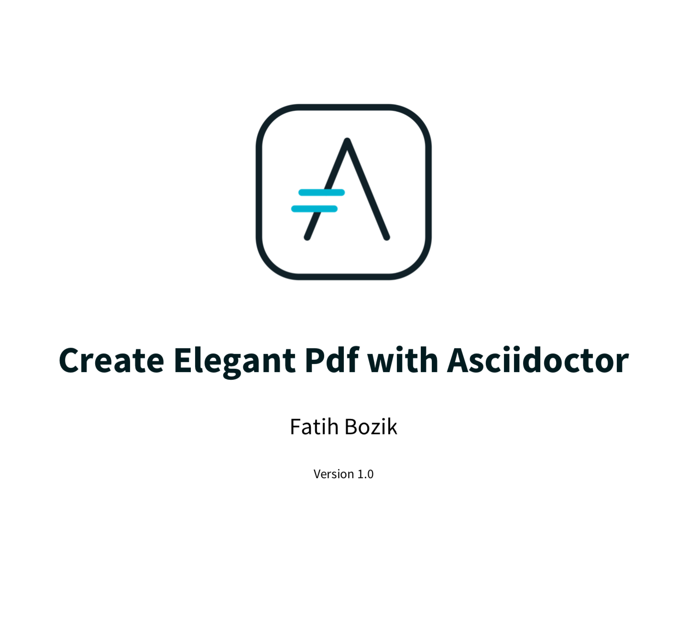
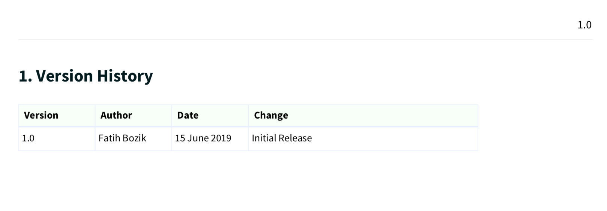
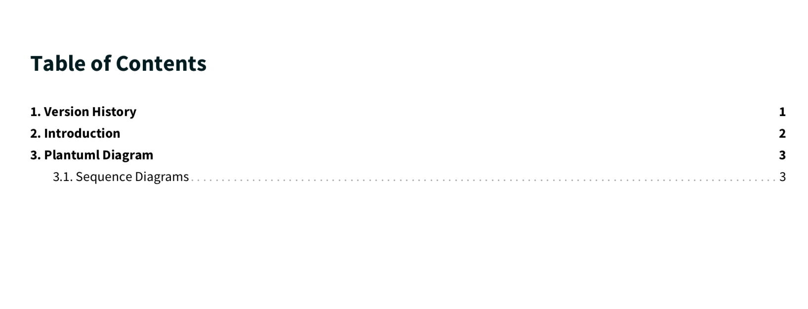
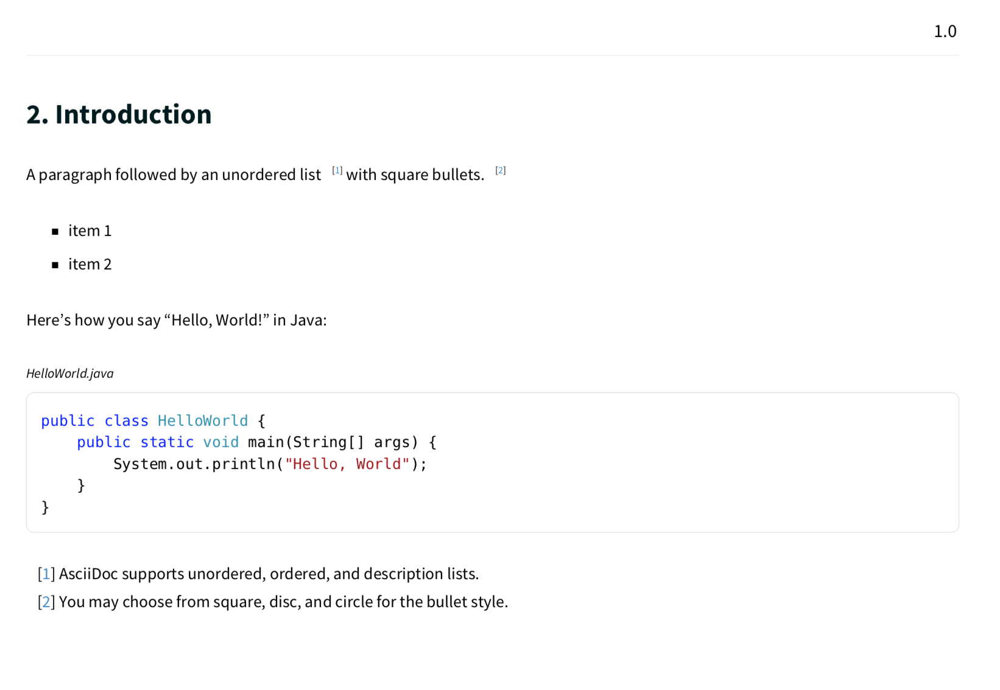
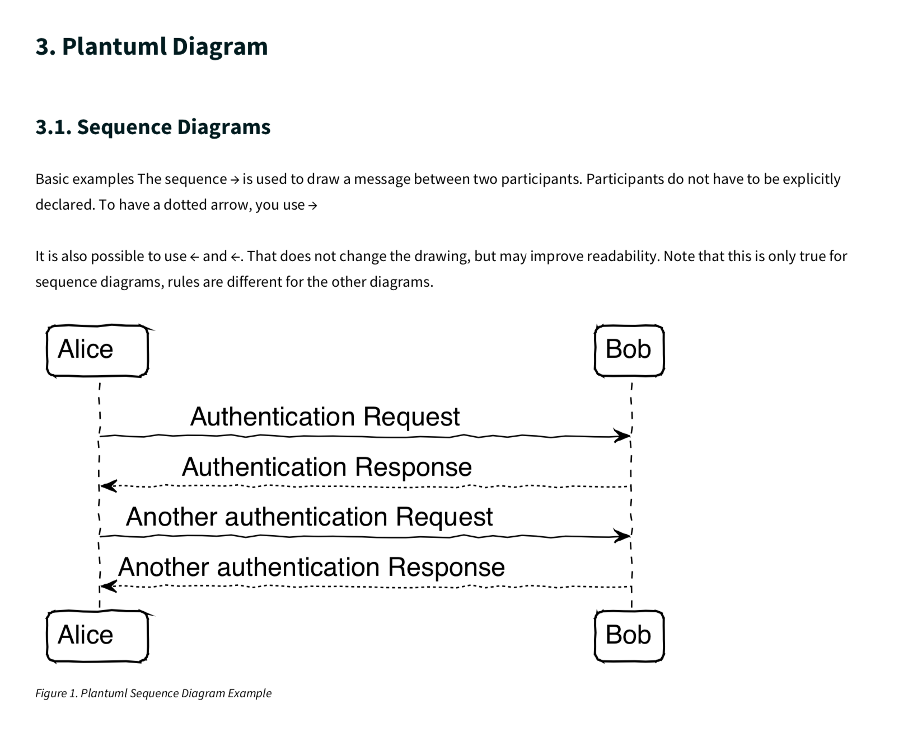

= Elegant Pdf With Asciidoctor

Create elegant pdf document using asciidoctor-pdf.

[source,bash]
----
docker-compose up
----

== Pdf Screenshots

.Title

.Version History

.Contents

.Introduction

.Plantuml

